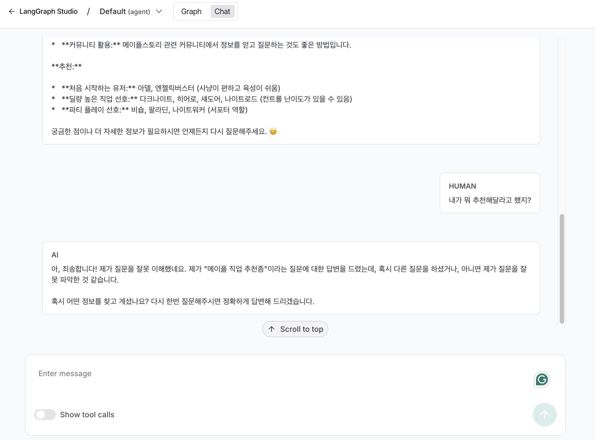

# langgraph-dev-example
LangGraph 로컬 개발 예제

- LangGraph 개발 시 백엔드 구현 없이 그래프만으로 로컬 개발이 가능합니다.
- LangGraph studio 를 활용하면 됩니다. (아래 스크린샷 참고)

## How to run (mac)
- python -m venv venv
- source venv/bin/activate
- pip install -r requirements.txt

#### LangGraph studio install
- pip install -U "langgraph-cli[inmem]"
- 이후 cli 에서 langgraph dev 입력

## LangGraph Studio Screenshots

